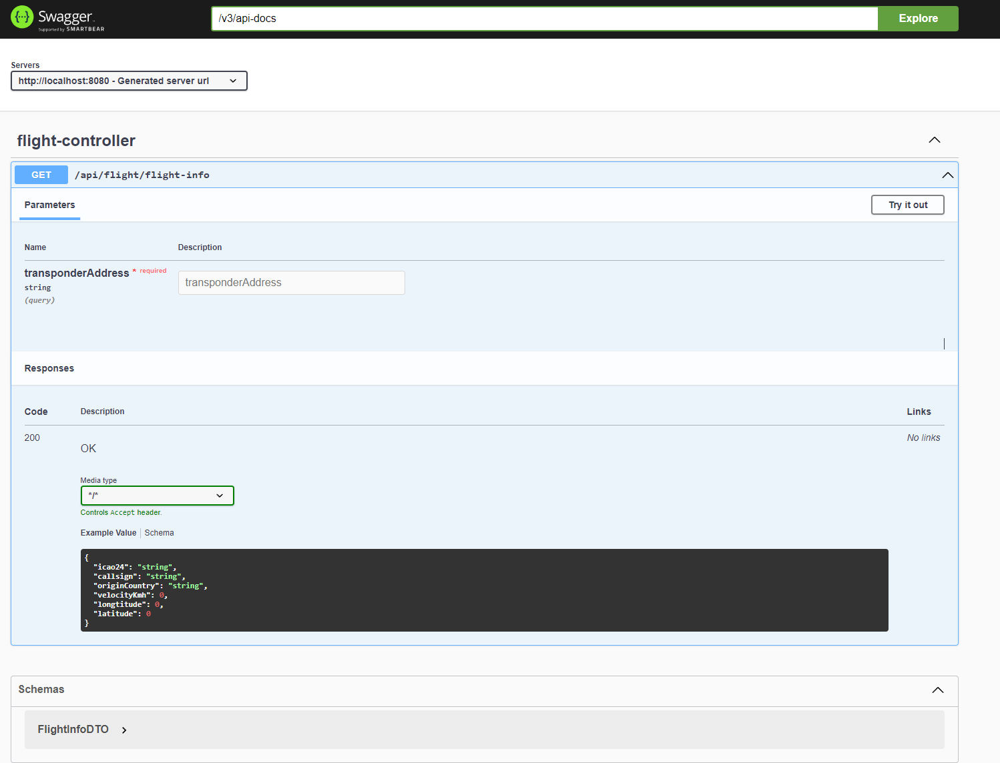
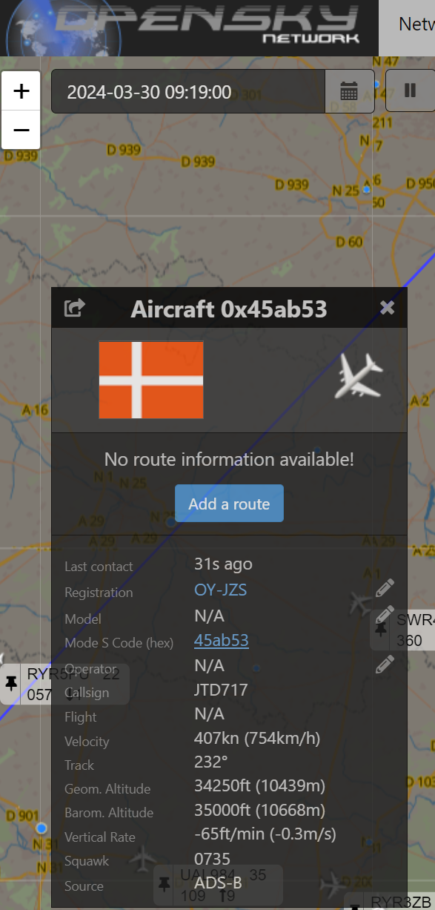

### OpenskyAPI & NominatimAPI

#### Author Jdacoder
#### Created on : 26-03-2024
#### Updated on : 30-03-2024
#### Version 1.00


### Requirments
* Idea of your choice
* Browser
* Java 21 
* Maven 3.9.5

### Dependencies


### Project Installation

1. Clone the repository

```git clone https://github.com/darksos34/Flightdata.git ```

2. Go into the ```flightdata``` folder:

```cd flightdata ```

3. Build the project using Maven:

```mvn clean install ```

4. Run the Spring boot application:

```mvn spring-boot:run ```


### API Endpoint
If your application is running then 

* Open the browser and go to http://localhost:8080



* Open a second browser and

* Go to https://opensky-network.org/network/explorer

* Find a plane of your choice and press on the plane that is rendered on the map.

* You will need to copy the Mode S Code (hex) value.


